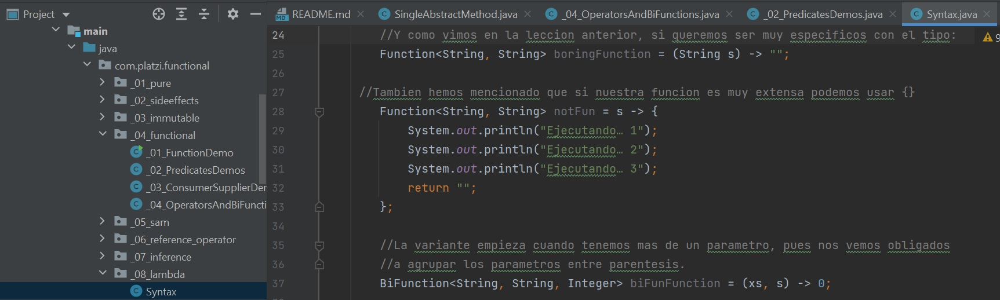
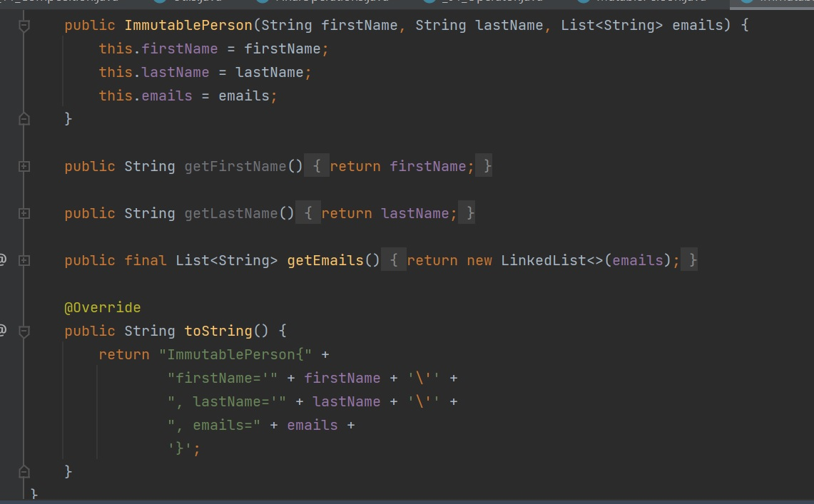

# Java Functional Programming Course

### Table of contents
* [Introduction](#introduction) 
* [Technologies](#technologies)
* [Syntax](#syntax)
* [Illustrations](#illustrations)


## Introduction
In this course we learn about functional programming and its parts. The basic objective of this style of programming is to make code more concise, less complex, more predictable, and easier to test compared to the legacy style of coding.

---------------------------------------------------------------

## Technologies
* IntelliJ IDEA 2021.1
* Java 11
---------------------------------------------------------------


## Syntax

##### Example to demonstrate a lambda expression

```
import java.util.Arrays;
import java.util.List;
public class GFG {
    public static void main(String[] args)
    {
        Runnable r
            = ()
            -> System.out.println(
                "Running in Runnable thread");
 
        r.run();
 
        System.out.println(
            "Running in main thread");
    }
}
```    
---------------------------------------------------------------

##### UnaryOperator

```  
	   UnaryOperator<String> quote = text -> "\"" + text + "\"";
      UnaryOperator<String> addMark = text -> text + "!";
      System.out.println(quote.apply("Hola Estudiante de platzi!"));
```
---------------------------------------------------------------
##### BiFunction

```
      BiFunction<String, Integer, String> leftPad =
      (text, number) -> String.format("%" + number + "s", text);
      System.out.println(leftPad.apply("Java", 10));
```


---------------------------------------------------------------

## Illustrations

##### Lambda example

**************************************
##### Immutable example

